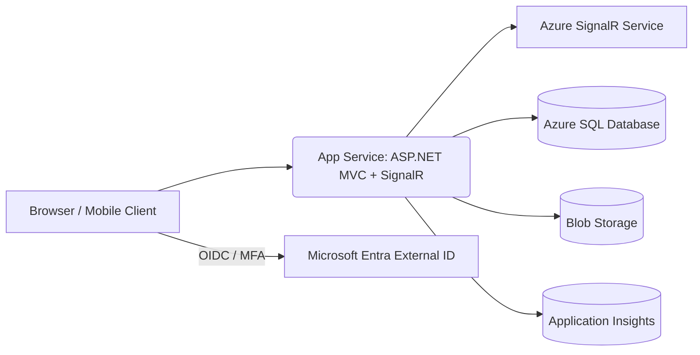

# 📚 D2L Real-Time Messaging App

> **ASP.NET Core MVC + SignalR application** that extends a learning management system (D2L/Brightspace) with modern, real-time messaging.  
> Built as a capstone project and deployed on **Azure PaaS** to demonstrate **cloud-first architecture, CI/CD, and sysadmin discipline**.

---

## ✨ Features

- **One-to-One Conversations**  
  Private messaging between classmates or instructor/student, grouped by course enrollment.

- **Real-Time Updates**  
  Live messaging powered by SignalR, including read receipts and typing indicators.

- **Course-Aware Context**  
  Conversations are scoped by courses. Students only see peers enrolled in the same class.

- **Message Management**  
  Edit, delete, unread counts, and read history tracking per user.

- **Cloud-Native Design**  
  - **App Service** for hosting the .NET app  
  - **Azure SQL Database** for relational storage  
  - **Azure SignalR Service** for scale-out WebSockets  
  - **Blob Storage** for future file attachments  
  - **Application Insights** for monitoring and telemetry  
  - **Microsoft Entra External ID** (OIDC + MFA) for modern authentication

---

## 🏗️ Architecture



---

## 📌 Roadmap

- [x] Basic conversations & classlist integration  
- [x] SignalR real-time messaging hub  
- [x] Read receipts, typing indicators  
- [ ] Replace local login with **Entra External ID (OIDC)**  
- [ ] Deploy to **Azure App Service** with CI/CD  
- [ ] Add **Blob Storage** for file sharing  
- [ ] IaC with Bicep for full reproducible infrastructure  
- [ ] Dashboarding via Application Insights KQL queries  

---

## 📖 Documentation

- [01 — Architecture](docs/01-Architecture.md)  
- [02 — Infrastructure](docs/02-Infrastructure.md)  
- [03 — Identity (Entra External ID)](docs/03-Identity-ExternalID.md)  
- [04 — CI/CD Guide](docs/04-CI-CD.md)  
- [05 — Runbook & Troubleshooting](docs/05-Runbook.md)  
- [06 — AppSettings Reference](docs/06-AppSettings.md)  
- [07 — Costs Estimates](docs/08-Costs-Estimates.md)  

---

## ⚡ Getting Started

### Local Development

1. **Requirements**
   - Visual Studio 2022 with ASP.NET workload  
   - SQL Server (local or Docker)  
   - .NET 8 SDK  

2. **Setup**
   ```bash
   git clone https://github.com/CoderHardlyKnower/D2LMessagingApp.git
   cd D2LMessagingApp
   ```

   - Create `appsettings.json`:
     ```json
     {
       "ConnectionStrings": {
         "DefaultConnection": "Server=YOUR_SERVER;Database=MessagingAppDB;Trusted_Connection=True;MultipleActiveResultSets=true;TrustServerCertificate=True"
       },
       "Logging": {
         "LogLevel": {
           "Default": "Information",
           "Microsoft.AspNetCore": "Warning"
         }
       },
       "AllowedHosts": "*"
     }
     ```
   - Run EF migrations:
     ```powershell
     Update-Database
     ```
   - Start app: `dotnet run`

### Cloud Deployment (Azure)

1. Provision resources:
   - App Service  
   - Azure SQL Database  
   - Azure SignalR Service  
   - Storage Account  
   - Application Insights  

2. Configure **App Service > Settings** with connection strings and secrets.  

3. Push to `main` branch — GitHub Actions CI/CD builds and deploys automatically.  

---

## 📜 License

[MIT](LICENSE) — free to use, modify, and distribute.

---

## 🙌 Acknowledgments

- **Conestoga College** — Capstone framework & guidance  
- **Brightspace / D2L** — LMS inspiration for integration  
- **Azure Docs** — cloud-native architecture patterns
